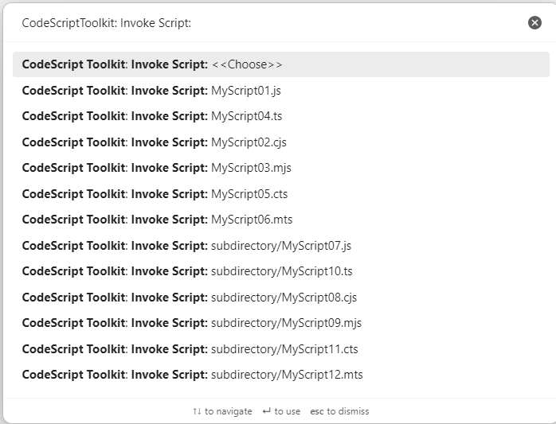
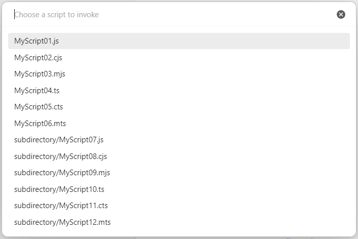
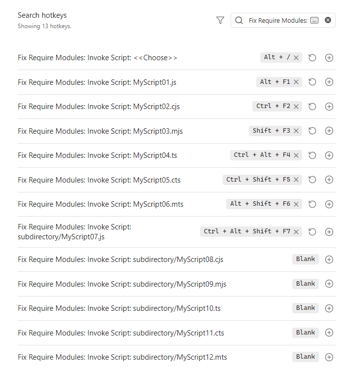
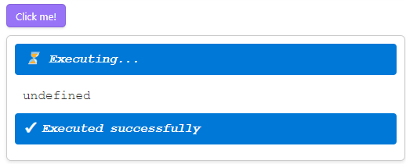

# Fix Require Modules

This is a plugin for [Obsidian](https://obsidian.md/) that fixes `require()` calls and simplifies working with custom `JavaScript`/`TypeScript` modules.

## Features

The detailed list of the features introduced by the plugin:

### Built-in modules

There are built-in modules are available for import during the Plugin development but shows `Uncaught Error: Cannot find module` error if you try to `require()` them from the [DevTools Console], [Templater] scripts, [dataviewjs] scripts etc.

The plugin fixes that problem and makes the following `require()` calls working properly:

```js
require("obsidian");
require("@codemirror/autocomplete");
require("@codemirror/collab");
require("@codemirror/commands");
require("@codemirror/language");
require("@codemirror/lint");
require("@codemirror/search");
require("@codemirror/state");
require("@codemirror/text");
require("@codemirror/view");
require("@lezer/common");
require("@lezer/lr");
require("@lezer/highlight");
```

You can use them as

```js
const obsidian = require("obsidian");
new obsidian.Notice("My notice");

const { Notice } = require("obsidian");
new Notice("My notice");
```

You can get the list of built-in module names, fixed by the plugin:

```js
app.plugins.getPlugin("fix-require-modules").builtInModuleNames
```

### Relative modules

Originally `require()` would throw `Cannot find module` error for:

```js
require("./some/relative/path.js");
require("../some/other/relative/path.js");
```

The plugin fixes that problem.

You can optionally provide the path to the current script/note, if the plugin couldn't detect it. Feel free to submit an [issue](https://github.com/mnaoumov/obsidian-fix-require-modules/issues) in that case.

```js
require("./some/relative/path.js", "path/to/current/script.js");
require("./some/relative/path.js", "path/to/current/note.md");
```

### Root-relative modules

The plugin adds the ability to use

```js
require("/path/from/root.js");
```

The root `/` directory is configurable via settings.

### [`ECMAScript Modules`][ESM]

Originally `require` function supported only `CommonJS` (`cjs`) modules and would throw `require() of ES Module path/to/script.mjs not supported. Instead change the require of path/to/script.mjs to a dynamic import() which is available in all CommonJS modules` error for:

```js
require("path/to/script.mjs");
```

The plugin fixes that problem.

Now you can use any kinds of JavaScript modules:

```js
require("path/to/script.js");
require("path/to/script.cjs");
require("path/to/script.mjs");
```

### [`TypeScript`][TypeScript] modules

Originally `require` function was built to support only `JavaScript` modules. The plugin adds support for `TypeScript` modules:

```js
require("path/to/script.ts");
require("path/to/script.cts");
require("path/to/script.mts");
```

### Smart caching

All the `require()`'d modules are cached for performance reasons, but the cache is invalidated if the script itself or any of its dependent scripts changed.

Therefore you can be sure that `require("./someScript.js")` will always get you the most actual version of the script.

### Source maps

The plugin properly manages compiled code's source maps allowing to seamlessly debug compiled code in `Obsidian` using original code.

### Invocable Scripts

You can make any script easily invocable via the plugin.

For that you need to define a module for with default export function (sync or async).

```ts
// cjs sync
module.exports = (param1) => {
  console.log(param1);
}

// cjs async
module.exports = async (param1) => {
  await Promise.resolve(param1);
}

// mjs sync
export default function someName(param1) {
  console.log(param1);
}

// mjs async
export default async function someName(param1) {
  await Promise.resolve(param1);
}

// cts sync
module.exports = (param1: string): void => {
  console.log(param1);
}

// cts async
module.exports = async (param1: string): Promise<void> => {
  await Promise.resolve(param1);
}

// mts sync
export default function someName(param1: string): void {
  console.log(param1);
}

// mts async
export default async function someName(param1: string): Promise<void> {
  await Promise.resolve(param1);
}
```

### Invoke Scripts

The plugin allows to configure a script directory, so every script from it and its subdirectories can be invoked using `Command Palette`.

In `Command Palette` the order of the scripts could be unpredictable, because `Obsidian` sorts commands based on some internal heuristics.



You can use custom command `Fix Require Modules: Invoke Script: <<Choose>>` to have more predictable lists



### Startup Script

The plugin adds a configuration setting to invoke any script when `Obsidian` loads.

### Hotkeys

You can also assign hotkeys for the most used scripts.



### Code buttons

The plugin adds the ability to create a code button that executes `JavaScript`/`TypeScript`, :

````markdown
```code-button Click me!
// CommonJS (cjs) style is supported
const { dependency1 } = require("./path/to/script1.js");

// ES Modules (esm) style is supported
import { dependency2 } from "./path/to/script2.js";

// Top-level await is supported
await Promise.resolve(42);

// TypeScript syntax is supported
function myTypeScriptFn(arg: string): void {
}
```
````



## Tips

If you are planning to use scripts a lot, you might eventually want to install some `node` modules. If so, I recommend to put scripts in a `dot directory`, such as `.scripts` within your vault. `Obsidian` doesn't track changes within `dot directories` and won't re-index your `node_modules` folder over and over.

## Limitations

### Dynamic `import()`

It is currently impossible to extend dynamic `import()` expressions to support things like `const obsidian = await import("obsidian")`.

The reason for that is the limitation of `Electron` environment in `Obsidian`.

Although `Obsidian` starting from version `1.6.5` is shipped with `Node.js v20.14.0` which has `Module.register()` which allows to extend dynamic `import()` behavior.

But we cannot use `Module.register()` because it depends on `Node.js Workers` and fails with `The V8 platform used by this instance of Node does not support creating Workers`.

## Installation

- `Fix Require Modules` is available on [the official Community Plugins repository](https://obsidian.md/plugins) now.
- Beta releases can be installed through [BRAT](https://github.com/TfTHacker/obsidian42-brat)

## License

 © [Michael Naumov](https://github.com/mnaoumov/)

[DevTools Console]: https://developer.chrome.com/docs/devtools/console

[Templater]: https://silentvoid13.github.io/Templater/

[dataviewjs]: https://blacksmithgu.github.io/obsidian-dataview/api/intro/

[ESM]: https://nodejs.org/api/esm.html

[TypeScript]: https://www.typescriptlang.org/
